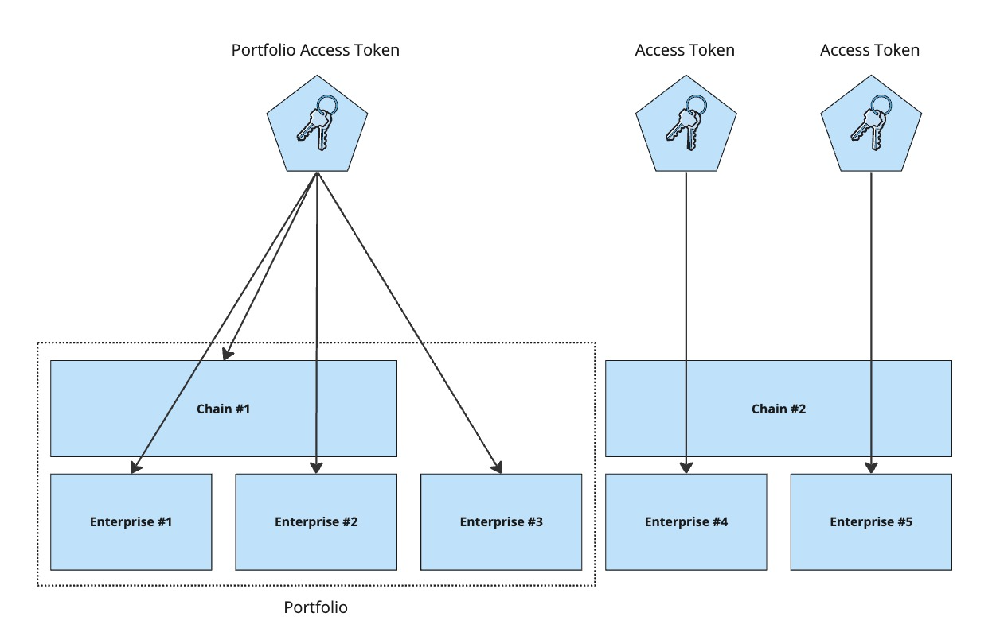

# Multi-property

> ### Terminology
>
> This feature introduces terms such as _Portfolio_, _Portfolio Access Token_ and _Chain_.
> For a full description of all the terms used, see the [Mews Glossary for Open API users](https://help.mews.com/s/article/Mews-Glossary-for-Open-API-users?language=en_US).

**Mews Multi-Property** is an optional feature of **Mews Operations**, which enables customers to easily manage a portfolio of multiple properties. A portfolio can be set up which allows all of the properties within the portfolio to be managed from one place, for example to centrally manage rates and vouchers.

## Portfolio Access Tokens

Multi-property functionality is reflected in the API through special **Portfolio Access Tokens**, these are `Access Tokens` that give API clients access to all of the enterprises or properties within scope of the portfolio, rather than just to a single enterprise.

## Enterprises

Not all API Operations support Portfolio Access Tokens. For those that do, they have an additional request parameter `EnterpriseId` (singular) or `EnterpriseIds` (plural). This enables you to specify which enterprise or enterprises you want to connect to or act upon, when using the operation. The enterprises specified must be within scope of the Portfolio Access Token you are using.

If the operation supports multiple enterprises, for example [Get all payments](../operations/payments.md#get-all-payments), and you use a Portfolio Access Token but do not specify the `EnterpriseIds` parameter, then the operation will connect to or act upon _all_ of the enterprises within scope of the `Access Token`.

Some operations, such as [Get configuration](../operations/configuration.md#get-configuration), accept Portfolio Access Tokens but only return information for a single enterprise. In this case, you must use the `EnterpriseId` parameter to specify which enterprise you are interested in. If you do not specify the `EnterpriseId` parameter, then the functionality is undefined, or rather it depends on the individual API operation. For example, in the case of [Get configuration](../operations/configuration.md#get-configuration), the operation returns information on the 'dummy' enterprise used to identify the portfolio.

## Chains

Independently of portfolios, properties can be grouped into chains. Chains are used to define legal relationships between enterprises, and for sharing certain data such as customer profiles. Some API operations support filtering by `ChainId`, e.g. [Get all companies](../operations/companies.md#get-all-companies) and [Get all loyalty programs](../operations/loyaltyprograms.md#get-all-loyalty-programs). When used in combination with a Portfolio Access Token, `ChainId` (singular) or `ChainIds` (plural) can be used to specify which chain or chains you want to connect to or act upon when using the operation, just like with `EnterpriseIds`. If the operation supports multiple chains, and you use a Portfolio Access Token but do not specify the `ChainIds` parameter, then the operation will connect to or act upon _all_ of the chains within scope of the `Access Token`.

## FAQ

### How can I obtain a Portfolio Access Token?

The **Mews Multi-Property** feature is not available for all customers, it depends on system configuration. For more information, please get in touch via [partnersuccess@mews.com](mailto:partnersuccess@mews.com).

### How can I tell if an Access Token is single enterprise or multi-enterprise in scope?

An `Access Token` is an opaque series of random characters. You cannot tell from looking at a token whether it supports a single enterprise or a portfolio of multiple enterprises.

### How can I tell if an API operation supports Portfolio Access Tokens?

The description for an API operation specifies if it supports Portfolio Access Tokens, e.g. see [Get all order items](../operations/orderitems.md#get-all-order-items). Such operations will normally also have `EnterpriseId` or `EnterpriseIds` as a request parameter.
